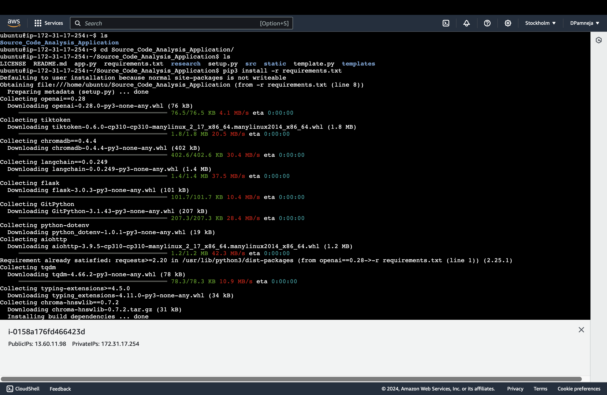

<a name="readme-top"></a>

[![Contributors][contributors-shield]][contributors-url]
[![Forks][forks-shield]][forks-url]
[![Stargazers][stars-shield]][stars-url]
[![Issues][issues-shield]][issues-url]
[![LinkedIn][linkedin-shield]][linkedin-url]
<!-- [![MIT License][license-shield]][license-url] -->


<!-- PROJECT LOGO -->
<br />
<div align="center">
  <a href="https://github.com/d-pamneja/Source_Code_Analysis_Application">
    
  </a>

<h3 align="center">Quiz Generator Application using Langchain</h3>

  <p align="center">
    The aim of this project is to generate quiz questions of MCQ or True/False type from a given text/PDF using 
    OpenAI models and Langchain API.
    <br />
    <br />
    <a href="https://github.com/d-pamneja/Source_Code_Analysis_Application/issues">Report Bug</a>
    ·
    <a href="https://github.com/d-pamneja/Source_Code_Analysis_Application/issues">Request Feature</a>
  </p>
</div>


<!-- TABLE OF CONTENTS -->
<details>
  <summary>Table of Contents</summary>
  <ol>
    <li>
      <a href="#about-the-project">About The Project</a>
      <ul>
        <li><a href="#built-with">Built With</a></li>
      </ul>
    </li>
    <li><a href="#deployment">Deployment</a></li>
    <li><a href="#contributing">Contributing</a></li>
    <li><a href="#contact">Contact</a></li>
  </ol>
</details>


<!-- ABOUT THE PROJECT -->
## About The Project

[![Product Name Screen Shot][product-screenshot]](https://example.com)

In this project, we have leveraged the capabilities of OpenAI models and Langchain API to generate quiz questions of MCQ or True/False type from a given text/PDF. The project aims to automate the process of generating quiz questions, thereby saving time and effort for educators, content creators, and learners. By utilizing advanced natural language processing (NLP) models, the application can extract key information from the text and formulate relevant quiz questions based on the content.

The user can decide the number of questions to be generated, and the complexity level of the questions. The application provides a user-friendly interface that allows users to input the text or upload a PDF document, select the desired parameters, and generate quiz questions with a single click. The generated questions can be used for educational purposes, training materials, assessments, or content creation across various domains.

<p align="right">(<a href="#readme-top">back to top</a>)</p>


### Built With

* [![openai][openai]][openai-url]
* [![langchain][langchain]][langchain-url]
* [![ChromaDB][chromadb]][chromadb-url]
* [![flask][flask]][flask-url]


<p align="right">(<a href="#readme-top">back to top</a>)</p>


<!-- DEPLOYMENT -->
## Deployment
The application is deployed via AWS EC2 instance. That can be achieved by following the steps below:

1. **Create an AWS EC2 Instance**: 
    - Launch an EC2 instance with the desired configuration.
    - Ensure that the security group associated with the instance allows inbound traffic on port 8501 (Streamlit default port).

2. **SSH into the EC2 Instance**:
    - Use the SSH key pair associated with the EC2 instance to connect to the instance.

3. **Install Required Packages**:
    - Install the necessary packages and dependencies on the EC2 instance.
    - Ensure that Python, Streamlit, and other required libraries are installed.
    - It can be done using the following commands:
    <br>
    <sh>

    ```
    sudo apt-get update
    ```

    ```
    sudo apt upgrade -y
    ```

    ```
    sudo apt install python3-pip git curl unzip tar make sudo vim wget -y
    ```

    ``` 
    git clone "Your-repository"
    ```

    ```
    cd "Your-repository"
    ```

    ```
    pip3 install -r requirements.txt
    ```
    </sh>


4. **Initialize the OPENAI API Key**:
    - Set up the OpenAI API key on the EC2 instance.
    - Create a `.env` file in the project directory and add the OpenAI API key.
    - The `.env` file should contain the following line:
    <br>
    <sh>

    ```
    OPENAI_API_KEY=your_openai_api_key
    ```
    </sh>

5. **Run the Streamlit Application**:
    - Run the Streamlit application on the EC2 instance.
    - Use the following command to start the Streamlit server:
    <br>
    <sh>

    ```
    python3 app.py
    ```
    </sh>


6. **Access the Application**:
    - Access the Streamlit application by visiting the public IP address of the EC2 instance followed by port 8501.
    - The application should be accessible via a web browser.
    - The URL format is as follows:

    <sh>
    
    ```
    http://"Your-EC2-Public-IP":8501
    ```
    </sh>

The application should now be up and running on the AWS EC2 instance, allowing users to generate quiz questions from text or PDF documents. The screenshots for the instance are shown below:



<p align="right">(<a href="#readme-top">back to top</a>)</p>

<!-- CONTRIBUTING -->
## Contributing

I'm thrilled to have you exploring my project! This endeavor is a collective effort, and we believe that every contribution adds value and creativity to our community.

How You Can Contribute:

🛠️ Found a bug? Have an idea for improvement? Fork the repo and create a pull request.

💡 Have a suggestion for making this project even better? Open an issue with the "enhancement" tag.

⭐ Like what you see? Show your support by giving our project a star!

Remember, your contributions, whether big or small, are incredibly valuable to us. They help us learn, inspire, and create a better project together.


1. Fork the Project
2. Create your Feature Branch (`git checkout -b feature/AmazingFeature`)
3. Commit your Changes (`git commit -m 'Add some AmazingFeature'`)
4. Push to the Branch (`git push origin feature/AmazingFeature`)
5. Open a Pull Request

Thank you for being a part of this journey!

<p align="right">(<a href="#readme-top">back to top</a>)</p>


<!-- CONTACT -->
## Contact

Dhruv Pamneja - dpamneja@gmail.com / 21f1001719@ds.study.iitm.ac.in

Project Link: [https://github.com/d-pamneja/Source_Code_Analysis_Application](https://github.com/d-pamneja/Source_Code_Analysis_Application)

<p align="right">(<a href="#readme-top">back to top</a>)</p>


<!-- MARKDOWN LINKS & IMAGES -->
<!-- https://www.markdownguide.org/basic-syntax/#reference-style-links -->
[contributors-shield]: https://img.shields.io/github/contributors/d-pamneja/Source_Code_Analysis_Application.svg?style=for-the-badge
[contributors-url]: https://github.com/d-pamneja/Source_Code_Analysis_Application/graphs/contributors
[forks-shield]: https://img.shields.io/github/forks/d-pamneja/Source_Code_Analysis_Application.svg?style=for-the-badge
[forks-url]: https://github.com/d-pamneja/d-pamneja/Source_Code_Analysis_Application/network/members
[stars-shield]: https://img.shields.io/github/stars/d-pamneja/Source_Code_Analysis_Application.svg?style=for-the-badge
[stars-url]: https://github.com/d-pamneja/Source_Code_Analysis_Application/stargazers
[issues-shield]: https://img.shields.io/github/issues/d-pamneja/Source_Code_Analysis_Application.svg?style=for-the-badge
[issues-url]: https://github.com/d-pamneja/Source_Code_Analysis_Application/issues
[license-shield]: https://img.shields.io/github/license/d-pamneja/Source_Code_Analysis_Application.svg?style=for-the-badge
[license-url]: https://github.com/d-pamneja/Source_Code_Analysis_Application/blob/master/LICENSE.txt
[linkedin-shield]: https://img.shields.io/badge/-LinkedIn-black.svg?style=for-the-badge&logo=linkedin&colorB=555
[linkedin-url]: https://www.linkedin.com/in/dhruv-pamneja-3b8432187/
[product-screenshot]: static/homepage_ss.png
[chromadb]: https://img.shields.io/badge/ChromaDB-Ready-brightgreen
[chromadb-url]: https://www.trychroma.com
[flask]: https://img.shields.io/badge/Flask-000000?style=for-the-badge&logo=flask&logoColor=white
[flask-url]: https://flask.palletsprojects.com/en/2.0.x/
[Next.js]: https://img.shields.io/badge/next.js-000000?style=for-the-badge&logo=nextdotjs&logoColor=white
[Next-url]: https://nextjs.org/
[React.js]: https://img.shields.io/badge/React-20232A?style=for-the-badge&logo=react&logoColor=61DAFB
[React-url]: https://reactjs.org/
[Vue.js]: https://img.shields.io/badge/Vue.js-35495E?style=for-the-badge&logo=vuedotjs&logoColor=4FC08D
[Vue-url]: https://vuejs.org/
[Angular.io]: https://img.shields.io/badge/Angular-DD0031?style=for-the-badge&logo=angular&logoColor=white
[Angular-url]: https://angular.io/
[Svelte.dev]: https://img.shields.io/badge/Svelte-4A4A55?style=for-the-badge&logo=svelte&logoColor=FF3E00
[Svelte-url]: https://svelte.dev/
[Laravel.com]: https://img.shields.io/badge/Laravel-FF2D20?style=for-the-badge&logo=laravel&logoColor=white
[Laravel-url]: https://laravel.com
[Bootstrap.com]: https://img.shields.io/badge/Bootstrap-563D7C?style=for-the-badge&logo=bootstrap&logoColor=white
[Bootstrap-url]: https://getbootstrap.com
[JQuery.com]: https://img.shields.io/badge/jQuery-0769AD?style=for-the-badge&logo=jquery&logoColor=white
[JQuery-url]: https://jquery.com 
[Pandas]: https://img.shields.io/badge/pandas-%23150458.svg?style=for-the-badge&logo=pandas&logoColor=white
[Pandas-url]: https://pandas.pydata.org
[scikit-learn]: https://img.shields.io/badge/scikit--learn-%23F7931E.svg?style=for-the-badge&logo=scikit-learn&logoColor=white
[scikit-learn-url]: https://scikit-learn.org/stable/
[openai]: https://img.shields.io/badge/OpenAI-5A5A5A?style=for-the-badge&logo=openai&logoColor=white
[openai-url]: https://openai.com
[langchain]: https://img.shields.io/badge/Langchain-FF2D20?style=for-the-badge&logo=langchain&logoColor=white
[langchain-url]: https://langchain.com
